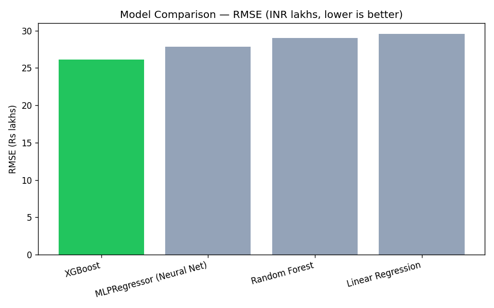
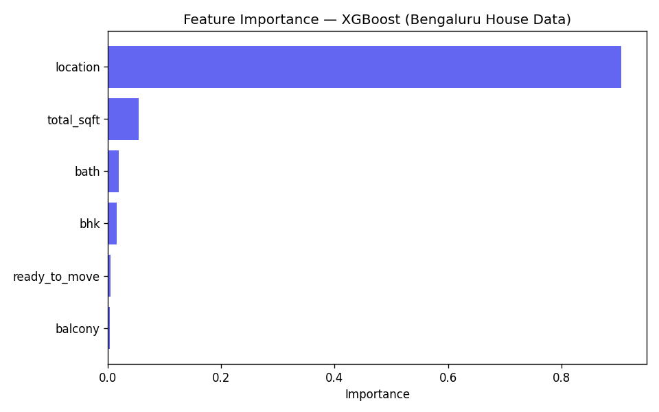

# Smart House Price Predictor

<p align="center">
  <a href="https://smart-house-price.vercel.app"><strong> Live Demo</strong></a> ·
  <a href="https://lucknow-house-price-api.onrender.com"><strong> API Health</strong></a> ·
  <a href="https://github.com/abhishekkasaudhan45/smart-house-price-prediction"><strong> GitHub</strong></a>
</p>

<p align="center">
  
  
  
  
  
  
  
</p>

A full-stack machine learning web application that predicts house prices for the housing market. Compares 4 ML models (Linear Regression, Random Forest, XGBoost, MLPRegressor), explains predictions with SHAP feature importance, provides ±15% confidence intervals, and stores every prediction in PostgreSQL.

---

## Architecture

```
User Browser (Vercel)
     │
     ▼
Flask API (Render — Docker container)
     │
     ├── ML Engine (scikit-learn, 4 models)
     ├── Input Validation
     ├── SHAP Feature Importance
     └── PostgreSQL Database (Render)
           └── Prediction history + stats
```

---

## Model Performance

| Model | R² Score | RMSE ($) | MAE ($) | Rank |
|---|---|---|---|---|
| **Random Forest** | **0.8721** | **$31,325** | **$20,948** | 1 |
| XGBoost | 0.8480 | $34,148 | $22,517 | 2 |
| Linear Regression | 0.7755 | $41,501 | $27,306 | 3 |
| MLPRegressor (Neural Net) | 0.5006 | $61,893 | $48,404 | 4 |

> **Winner:** Random Forest selected by lowest RMSE on test holdout (20%).

### Model Comparison Chart



### SHAP Feature Importance



**Top price drivers identified:**
1. **Overall Quality** — strongest determinant of home price
2. **Area (sq ft)** — larger homes command higher prices
3. **Year Built** — newer homes are valued more
4. **Total Rooms** — overall property size signal
5. **Bath/Bed Ratio** — bathroom-to-bedroom ratio

---

## Features

### ML Pipeline
- 4-model comparison with automated best-model selection (lowest RMSE)
- SHAP-based model interpretability
- Feature engineering (total rooms, bath/bed ratio)
- ±15% confidence intervals on every prediction

### Engineering
- **PostgreSQL** persistence — every prediction saved with full input/output
- **Docker** containerization — single-command deploy
- **CI/CD** — automated testing + deploy via GitHub Actions
- **Input validation** — client-side + server-side (dual layer)
- **9 pytest tests** — health, prediction, validation, history, stats

### API
| Endpoint | Method | Description |
|---|---|---|
| `/` | GET | Health check + DB status |
| `/predict` | POST | Predict house price |
| `/history` | GET | Last 20 predictions |
| `/stats` | GET | Aggregate stats (total, avg, min, max) |
| `/metrics` | GET | Model comparison data |
| `/feature-importance` | GET | SHAP summary plot PNG |

---

## Tech Stack

| Layer | Technology |
|---|---|
| **ML Training** | Pandas, NumPy, scikit-learn, XGBoost, SHAP |
| **Backend** | Flask, Flask-CORS, gunicorn |
| **Database** | PostgreSQL 16, SQLAlchemy ORM, Alembic |
| **Frontend** | HTML5, CSS3 (Inter font, Grid/Flexbox), Vanilla JS |
| **Containerization** | Docker (python:3.12), docker-compose |
| **CI/CD** | GitHub Actions, Render Deploy Hooks |
| **Deployment** | Render (API), Vercel (Frontend) |
| **Dataset** | Kaggle "House Prices" — 1,460 real listings, 8 features |

---

## Project Structure

```
Backend_API/           # Flask REST API
├── app.py             — Application + 6 endpoints
├── database.py        — SQLAlchemy engine + session
├── models.py          — Prediction ORM model
├── Dockerfile         — Container image (python:3.12)
├── requirements.txt
├── alembic/           — Schema migrations
└── *.pkl / *.png      — ML artifacts

Fronted_UI/            # Static frontend (Vercel)
├── index.html
├── style.css
└── Script.js

ML_Training/           # Data generation & model training
├── house_data.csv     — 1,000 listings
├── advanced_training.ipynb — 4-model comparison + SHAP
├── training.ipynb     — Original (2 models)
├── eda.ipynb          — Exploratory analysis
└── data.py            — Synthetic data generator

tests/                 # pytest test suite (9 tests)
└── test_api.py

.github/workflows/
└── ci.yml             — GitHub Actions pipeline
```

---

## Quick Start

### Prerequisites
- Python 3.12+
- Docker (optional — for containerized run)

### Backend (local)

```bash
cd Backend_API
pip install -r requirements.txt
python app.py
# → http://localhost:10000
```

### Frontend (local)

```bash
cd Fronted_UI
python -m http.server 8080
# → http://localhost:8080
```

### With Docker

```bash
make docker-build
make docker-run
# → http://localhost:10000
```

### Tests

```bash
make test
# or
python -m pytest tests/ -v
```

---

## Deployment

### Render (API)
1. Push repo to GitHub
2. Render → New Web Service → connect repo
3. Settings:
   - **Dockerfile Path:** `./Backend_API/Dockerfile`
   - **Build Command:** *(empty)*
   - **Start Command:** *(empty)*
4. Add env var `DATABASE_URL` (Render PostgreSQL internal URL)
5. Deploy

### Vercel (Frontend)
1. Push `Fronted_UI/` to GitHub
2. Vercel → Import Project → connect repo
3. It auto-deploys. The JS connects to `https://lucknow-house-price-api.onrender.com`

---

## What I Built

- An end-to-end ML system from synthetic data generation through production deployment
- Systematic model evaluation with SHAP interpretability
- A production-grade Flask API with PostgreSQL, Docker, and CI/CD
- Professional engineering practices: testing, linting, pre-commit, containerization

---

<p align="center">
  Created by <strong>Abhishek Kasaudhan</strong>
</p>
